# Delhi Metro Management System

### Objective:
The objective of this project is to develop a simplified **Delhi Metro Management System** using **C language**, which simulates essential functionalities of a metro system such as login, balance management, fare calculation, and ticket booking. This project uses basic programming concepts like loops, arrays, and conditional statements, making it a user-friendly mini-project.

---

## Features:

### 1. Login System:
- Secure login system with masked password entry using asterisks (`*`) for better security.

### 2. Menu System:
- A menu that allows users to:
  - **Add balance**: User can add balance to their account.
  - **View balance**: User can view the current balance at any time.
  - **Book tickets**: Users can select starting and destination stations from available metro lines (Yellow, Pink, Blue).
  
### 3. Station Selection:
- Users can choose from **Yellow**, **Pink**, and **Blue** line metro stations.

### 4. Fare Calculation:
- Based on the user’s selected starting and destination stations, the fare is calculated using predefined fare rules.
- The balance is deducted according to the calculated fare, and the system ensures that the user has enough balance before booking a ticket.

---

## Approach:
The system consists of:
- A **login feature** for user authentication.
- A **main menu** to manage the user’s actions.
- A **metro line system** where the stations are handled using loops and arrays.

Conditional statements (`if-else`) are used to:
- Manage ticket booking and balance checking.
- Ensure that the balance is sufficient for ticket booking.

---

## Key Modules:

### 1. Login System:
- Implements a secure login using arrays for storing **username** and **password**.
- Password entry is masked with asterisks (`*`) to improve security.

### 2. Balance Management:
- Users can add balance to their account.
- Users can view their current balance at any time.

### 3. Ticket Booking:
- Users can select **starting** and **destination** stations from available metro lines (Yellow, Pink, Blue).
- The system calculates the fare using predefined rates between stations.
- Tickets are booked only if the user has sufficient balance.

### 4. Fare Calculation:
- Uses **loops** and **arrays** to store and manage station data.
- The fare is calculated based on the distance (or predefined fare rates) between two selected stations.(Reference- Noida electronics city)

---

## Contributors:
- **Prashant Kumar Garg**
- **Kavya Singhal**
- **Krish Mehra**
